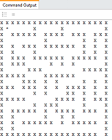

[](https://classroom.github.com/online_ide?assignment_repo_id=10076093&assignment_repo_type=AssignmentRepo)
# Breadth-First Search




## Introduction


Recall one basic algorithm for breadth-first search (BFS) in an unweighted (all step costs = 1) graph:

```
bfs(start vertex, goal vertex):
  make frontier an empty queue
  enqueue start onto frontier
  until frontier is empty
    dequeue parent off frontier
    for each undiscovered child of parent
      enqueue child onto frontier
      stop if child is the goal
```

To apply this algorithm to a maze (see picture at top), 
think of grid locations as vertices. The "children" of a grid location are the open cells adjacent to it 
in the four cardinal directions (north, south, east, west).

## Implementation


Adjust the height of your console/PyCharm window to match the maze height, 
so that each display appears in the same place each tick.

In this implementation, let's represent possible moves (the four cardinal directions) 
using the strings `'N', 'S', 'E', 'W'`.

After completing the three methods marked "YOU FILL THIS IN", your `bfs_maze.main` driver method 
should work. Simulate the maze by executing the `main`.

How does the code work? Take a long look at the methods in the starter code, the arguments they accept, 
and the values they return. This is sort of like a big puzzle to figure out. Also consult the 
`bfs_maze_tester.py` file for example method calls to be better understand the values that should be 
returned.

**Algorithm notes:**

- You will need to keep track of the sequence of moves by which you discovered each location. 
  
**"More Advanced" Python notes:**

- (Feel free to ignore this if it is not applicable to your implementation.) 
  If you want to put Maze objects into sets or use them as dictionary keys, 
  remember to overload the `__hash__` and `__eq__` and `__ne__` methods of the `Maze` class.

## Autograding / Testing

Keep your BFS maze implementation program named `bfs_maze.py`. 

The pytest methods are located in `bfs_maze_tester.py`. To execute the pytests, you'll need the pytest package. To get it, on the command line type:

```bash
pip3 install pytest
```

Then to run all tests type 

```bash
pytest bfs_maze_tester.py
```

Feel free to include additional tests as long as you don't overwrite my original tests.


